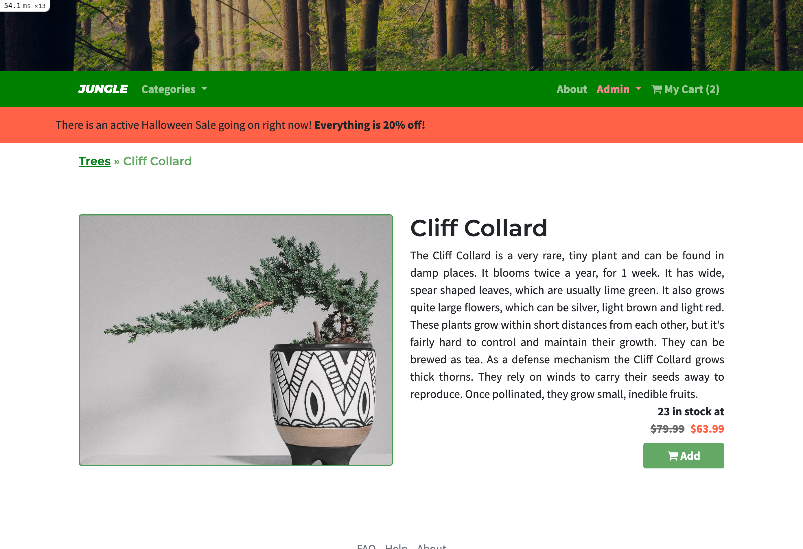
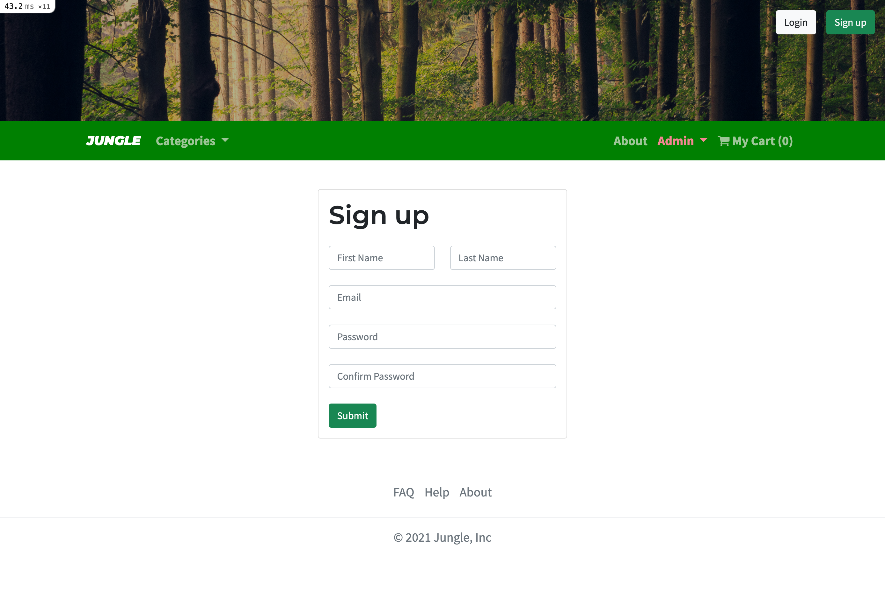
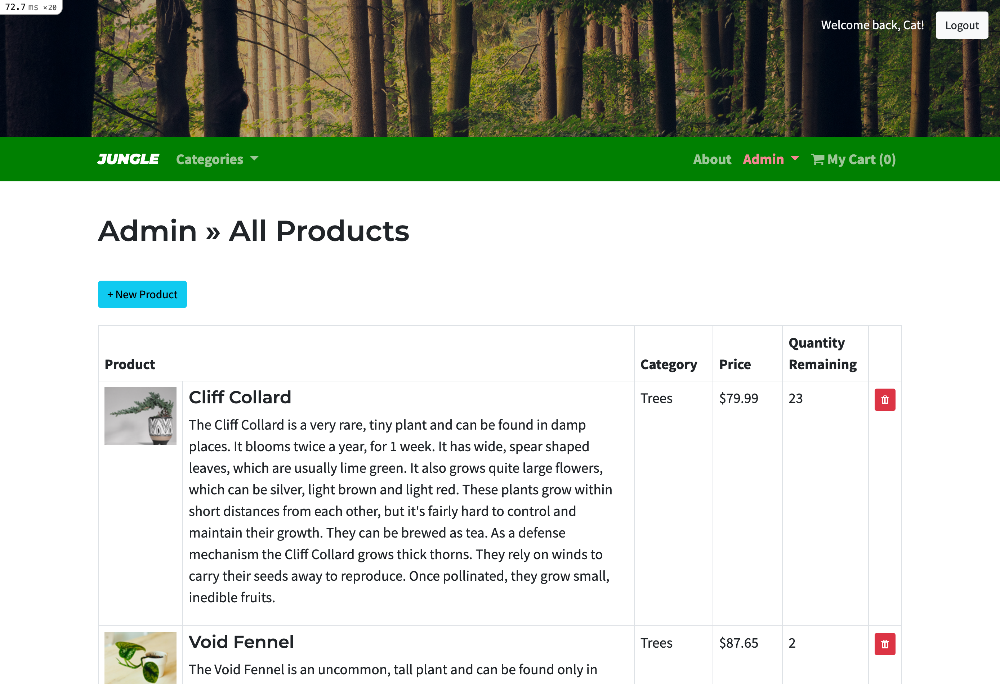
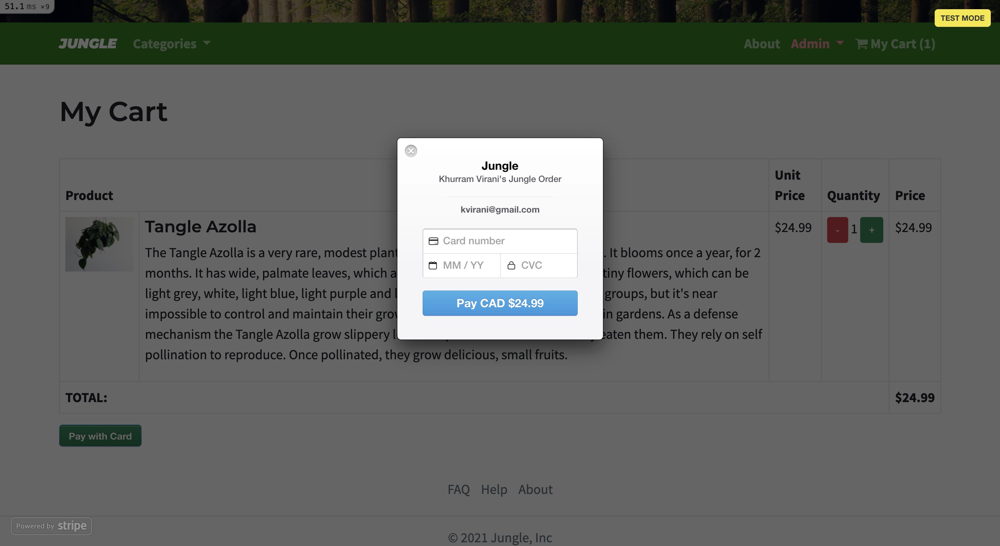

# Jungle

A mini e-commerce application built with Rails 6.1 for purposes of teaching Rails by example.

## Purpose
This project was built as a part of our learnings at [Lighthouse Labs](https://www.lighthouselabs.ca).

## Final Product
**View of Home Page for Logged in User**

**View of Individual Product with Active Sale**

**View of Sign Up Page for Visitor**

**View of Admin Products Page**

**View of Stripe Checkout**

## Features
**View Products**
- See all products in inventory
- Search products by category
- Click on a product to view more details

**My Cart**
- Add and remove products to cart
- Detailed view of order
- Simple checkout using Stripe

**Admin Dashboard**
- View and update all products
- View and update all categories
- Get overview of products and categories on dashboard

**Manage Discounts**
- Admin access to sale management
- Create, update or delete sale
- Customize by choosing name, dates, and percent off

## Setup

1. Run `bundle install` to install dependencies
2. Create `config/database.yml` by copying `config/database.example.yml`
3. Create `config/secrets.yml` by copying `config/secrets.example.yml`
4. Run `bin/rails db:reset` to create, load and seed db
5. Create .env file based on .env.example
6. Sign up for a Stripe account
7. Put Stripe (test) keys into appropriate .env vars
8. Run `bin/rails s -b 0.0.0.0` to start the server

## Database

If Rails is complaining about authentication to the database, uncomment the user and password fields from `config/database.yml` in the development and test sections, and replace if necessary the user and password `development` to an existing database user.

## Stripe Testing

Use Credit Card # 4111 1111 1111 1111 for testing success scenarios.

More information in their docs: <https://stripe.com/docs/testing#cards>

## Dependencies

- Rails 6.1 [Rails Guide](http://guides.rubyonrails.org/v6.1/)
- Bootstrap 5
- PostgreSQL 9.x
- Stripe
